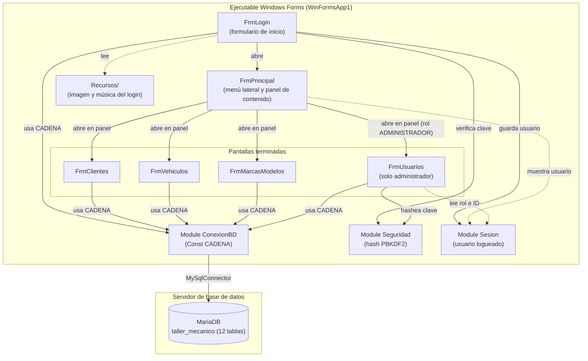

# WinFormsApp1 (Taller Mecánico)

<!-- Lo delimitado por @tsg-docs:auto-start/auto-end se regenera automáticamente. Editar fuera de esos bloques. -->

Aplicación de escritorio para gestionar los servicios de un taller mecánico (trabajo práctico universitario).

> **Importante:** el proyecto se abre desde `WinFormsApp1.slnx` en Visual Studio. Si se abre en modo *Folder View* el diseñador de formularios queda deshabilitado. La cadena de conexión a la base de datos se configura a mano en `WinFormsApp1/ConexionBD.vb` (ver [Secrets](#secrets)).

---

## Qué es

Aplicación Windows Forms en VB.NET que administra el ciclo de atención de un taller mecánico sobre una base MariaDB: clientes, vehículos y, a futuro, recepción, presupuesto, órdenes de trabajo y reportes. Cubre únicamente la actividad de **servicios**: queda fuera la facturación, los pagos, la venta de insumos y el control de stock.

Estado actual: están terminadas las pantallas de **Clientes**, **Vehículos**, **Marcas y modelos** y **Usuarios** (esta última solo visible para el administrador). El login muestra imagen de fondo y música y **valida usuario y contraseña** contra la tabla `usuario` (hash PBKDF2); el usuario que ingresó se muestra en la barra superior. El menú principal **se filtra por rol** (ver [Menú por rol](#menú-por-rol)). El resto de las opciones del menú no tiene pantalla (ver [Estado](#estado)).

El código sigue de forma deliberada el estilo de la cátedra de programación orientada a eventos (SQL dentro de los formularios, sin capa de acceso a datos). No es una arquitectura por capas.

### Menú por rol

El menú principal muestra a cada usuario solo las opciones de su rol. Los botones están ocultos por defecto en el diseñador y `FrmPrincipal_Load` muestra los que corresponden según `Sesion.Rol`; un rol desconocido no ve ninguna opción.

| Opción del menú | ADMINISTRADOR | OPERADOR | MECANICO |
|---|---|---|---|
| Recepción | Sí | Sí | No |
| Órdenes de trabajo | Sí | Sí | No |
| Historial | Sí | Sí | Sí |
| Clientes | Sí | Sí | No |
| Vehículos | Sí | Sí | No |
| Marcas y modelos | Sí | Sí | No |
| Servicios | Sí | No | No |
| Categorías | Sí | No | No |
| Mecánicos | Sí | No | No |
| Usuarios | Sí | No | No |
| Reportes | Sí | No | No |

Los títulos de sección siguen la misma regla: "OPERACIONES" se muestra a todos los roles, "DATOS MAESTROS" al administrador y al operador, y "REPORTES" solo al administrador.

---

<!-- @tsg-docs:auto-start -->

## Arquitectura

- **Lenguaje:** VB.NET
- **Plataforma:** .NET 10 (`net10.0-windows`), Windows Forms, `OutputType` WinExe
- **Patrones:** programación orientada a eventos; un único proyecto; formularios creados con el diseñador de Visual Studio y manejadores con `Handles`; SQL escrito dentro de los eventos del formulario (`Using cn` / `Using cmd`); sin clases DAO ni separación en capas
- **Infraestructura:** cliente de escritorio de dos capas contra MariaDB (desarrollado con MariaDB 12.2, base `taller_mecanico`) mediante el paquete MySqlConnector 2.6.2

### Diagrama



<!-- @tsg-docs:auto-end -->

---

## Quick start (local)

### Prerequisites

- Windows (el proyecto apunta a `net10.0-windows`).
- .NET 10 SDK.
- Visual Studio con la carga de trabajo de desarrollo de escritorio de .NET (Windows Forms y Visual Basic).
- MariaDB en ejecución local (el proyecto se desarrolló contra MariaDB 12.2; el script DDL indica MariaDB 10.6 o superior) y un cliente SQL para ejecutar los scripts (el repo menciona DBeaver en los comentarios de las consultas).

### Run

1. Crear la base ejecutando los scripts de `database/` en orden numérico:

   | Script | Qué hace |
   |---|---|
   | `01_ddl_estructura.sql` | Crea la base `taller_mecanico` y las 12 tablas. **Elimina la base completa si ya existe** (`DROP DATABASE IF EXISTS`): comentar esa línea si hay datos que conservar. |
   | `02_dml_catalogos.sql` | Carga los catálogos necesarios para funcionar (estados de OT, categorías de servicio y el usuario administrador inicial). Se ejecuta una vez. |
   | `03_dml_prueba.sql` | Datos de prueba (mecánicos, usuarios, marcas, modelos, clientes, vehículos y servicios). **Solo desarrollo.** |
   | `04_consultas_verificacion.sql` | Consultas de verificación (cantidad de tablas, filas por tabla, etc.). Opcional. |
   | `05_consultas_basicas.sql` | Consultas de práctica de solo lectura. Opcional. |
   | `06_migracion_hash_pbkdf2.sql` | Migración para bases ya cargadas con una versión anterior de 01 a 03: agrega la columna `salt` y reemplaza los hashes de los usuarios semilla. **Una instalación nueva con 01 a 03 no la necesita.** |

2. Ajustar la cadena de conexión: editar `Server`, `Port`, `User ID` y `Password=` en `WinFormsApp1/ConexionBD.vb` según la instalación local de MariaDB.
3. Abrir `WinFormsApp1.slnx` en Visual Studio y ejecutar, o desde una terminal:

```bash
dotnet run --project WinFormsApp1
```

> No hay pruebas automatizadas que ejecutar. Los usuarios del sistema están definidos en `database/02_dml_catalogos.sql` y `database/03_dml_prueba.sql`, y el login los valida (las contraseñas de prueba figuran en los comentarios de esos scripts). Las contraseñas se guardan con PBKDF2 + SHA256 (100000 iteraciones, hash de 32 bytes, salt de 16 bytes, ambos en Base64); el salt está en la columna `usuario.salt`.

---

<!-- @tsg-docs:auto-start -->

## Configuración

### Variables de entorno

| Variable | Descripción | Ejemplo | Obligatoria |
|---|---|---|---|
| _Sin entradas detectadas — completar manualmente_ | La aplicación no lee variables de entorno (no hay usos de `GetEnvironmentVariable` en el código). | — | — |

La única configuración es la constante `CADENA` de `WinFormsApp1/ConexionBD.vb` (servidor, puerto, base, usuario y contraseña).

### appsettings por entorno

No aplica: aplicación de escritorio WinForms. No existen archivos `appsettings*.json` en el proyecto.

---

## Implementación productiva

### Docker

No aplica: aplicación de escritorio WinForms. No hay `Dockerfile` ni `docker-compose` en el repositorio.

### Health checks

| Endpoint | Propósito |
|---|---|
| No aplica | Aplicación de escritorio WinForms: no expone endpoints. |

### Logging y observabilidad

- **Logger:** No implementado. Los errores se muestran al usuario con `MessageBox.Show`.
- **Sinks:** No aplica.
- **Tracing:** No aplica: aplicación de escritorio WinForms.
- **Métricas:** No aplica: aplicación de escritorio WinForms.

### Secrets

La cadena de conexión, incluida la contraseña de la base, está escrita directamente en `WinFormsApp1/ConexionBD.vb` y la versión confirmada en git la contiene, en un repositorio público. No se usa gestor de secretos ni variables de entorno. Cada desarrollador mantiene su valor local con:

```bash
git update-index --skip-worktree WinFormsApp1/ConexionBD.vb
```

Esto evita confirmar cambios locales, pero no retira del historial el valor ya publicado. Recomendación pendiente: cambiar la contraseña de la base de desarrollo y mover la cadena a un archivo de configuración fuera del repositorio.

### Migrations / inicialización

No hay herramienta de migraciones. La base se crea y se inicializa ejecutando manualmente los scripts de `database/` (ver [Quick start](#quick-start-local)). El script `01_ddl_estructura.sql` recrea la base desde cero.

### CI/CD

No implementado: no hay pipelines en el repositorio.

---

## Endpoints expuestos

No aplica: aplicación de escritorio WinForms. No expone endpoints.

---

## Estado

- **Versión:** _TODO: completar manualmente_ (el proyecto no define versión en `WinFormsApp1.vbproj`).
- **Status:** En desarrollo (trabajo práctico universitario).
  - Terminado: Clientes (ABM, baja lógica, búsqueda en vivo), Vehículos (ABM con combos de titular y marca/modelo en cascada, baja lógica), Marcas y modelos (maestro-detalle), Usuarios (ABM con baja lógica; contraseña guardada con PBKDF2 al crear o modificar; el rol MECANICO exige elegir un mecánico; el administrador no puede darse de baja ni cambiar su propio rol; el botón del menú solo se muestra para el rol ADMINISTRADOR).
  - Terminado: Login (imagen y música; valida usuario activo y contraseña contra `usuario`, con un mensaje único para usuario inexistente o clave incorrecta; guarda el usuario en `Sesion` y la barra superior de `FrmPrincipal` muestra nombre y rol; el botón "Cerrar sesión" de esa barra vuelve al login vacío para que ingrese otro usuario).
  - Terminado: Menú por rol (`FrmPrincipal` está armado en el diseñador y muestra en `FrmPrincipal_Load` solo las opciones del rol que ingresó; ver [Menú por rol](#menú-por-rol)). Aún no se aplican permisos por rol dentro de cada pantalla, salvo en Usuarios.
  - Sin pantalla todavía (botones del menú sin evento): Recepción, Órdenes de trabajo, Historial, Servicios, Categorías, Mecánicos y Reportes.
  - Decisión cerrada: hash de contraseñas con PBKDF2 + SHA256, igual que la referencia de la cátedra (reemplaza la mención de BCrypt de la especificación). Las bases ya cargadas deben ejecutar `database/06_migracion_hash_pbkdf2.sql`.

<!-- @tsg-docs:auto-end -->

---

## Documentación adicional

- [Docu.md](./doc/Docu.md) — referencia técnica profunda
