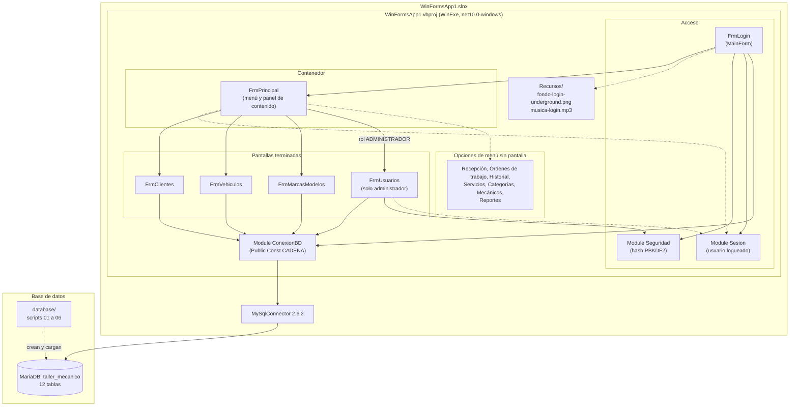
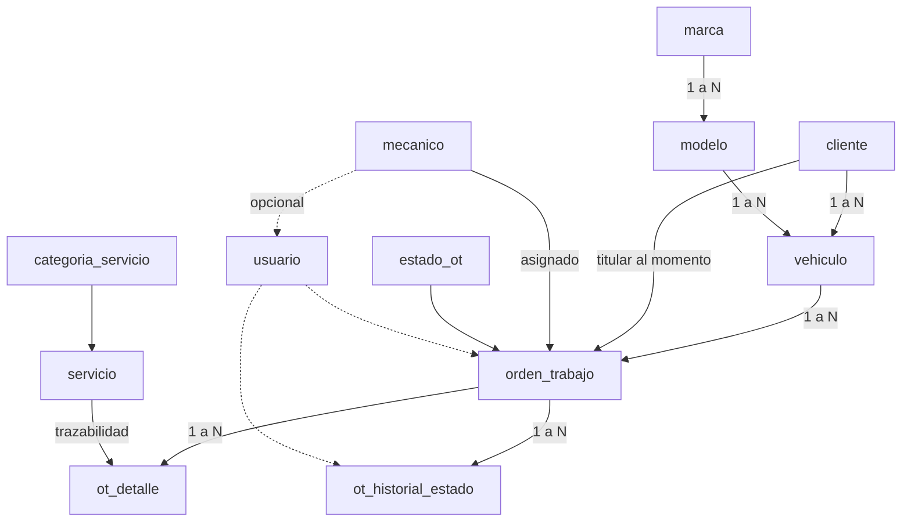
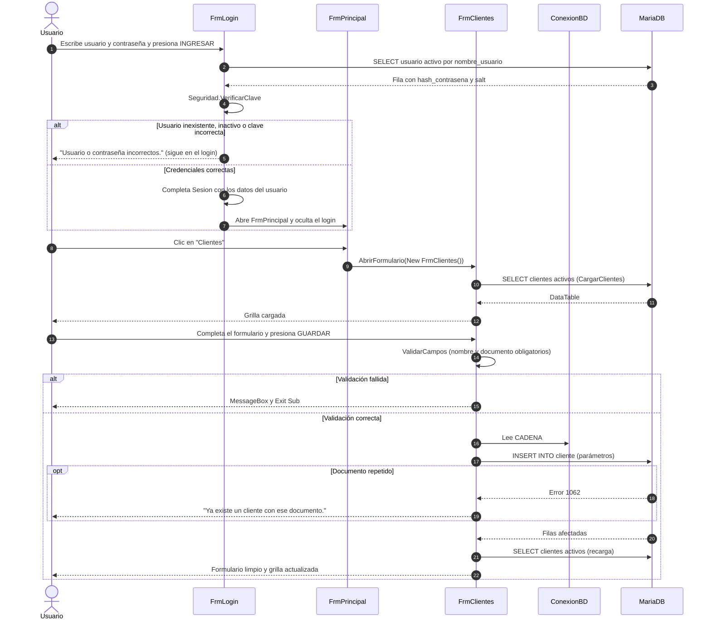

# WinFormsApp1 (Taller Mecánico) — Documentación técnica

<!-- Lo delimitado por @tsg-docs:auto-start/auto-end se regenera automáticamente. Editar fuera de esos bloques. -->

---

## Qué es

Aplicación de escritorio Windows Forms (VB.NET, .NET 10) conectada a una base MariaDB, que administra los servicios de un taller mecánico. Es un trabajo práctico universitario. El alcance acordado con la cátedra el 27/08 cubre solo la actividad de **servicios**: queda fuera la facturación, los pagos, la venta de insumos y el control de stock (`taller-mecanico-especificacion.md`, sección 2).

Repositorio: https://github.com/MedinaLucas1996/taller-mecanico (público).

## Cómo funciona

- El proyecto de inicio es `FrmLogin` (`MainForm` en `My Project/Application.myapp`). Muestra una imagen de fondo y reproduce música en bucle, ambas desde `WinFormsApp1/Recursos/`. El botón INGRESAR (también con Enter) valida que usuario y contraseña no estén vacíos, busca el usuario activo en `usuario` por `nombre_usuario` y verifica la contraseña con `Seguridad.VerificarClave`. Si el usuario no existe, está inactivo o la clave es incorrecta, muestra el mismo mensaje ("Usuario o contraseña incorrectos."), limpia la contraseña y permanece en el login. Si es correcto, completa el `Module Sesion` (`IdUsuario`, `NombreUsuario`, `NombreCompleto`, `Rol`, `IdMecanico`, este último en 0 si el usuario no es mecánico), abre `FrmPrincipal`, detiene la música y oculta el login.
- `Module Seguridad` implementa el hash de contraseñas con PBKDF2 + SHA256 (100000 iteraciones, hash de 32 bytes, salt aleatorio de 16 bytes, ambos en Base64): `GenerarSalt`, `HashearClave` y `VerificarClave` (comparación en tiempo constante; devuelve `False` si el hash o el salt guardados no son Base64 válido, por ejemplo un hash BCrypt anterior). `Module Sesion` guarda los datos del usuario que inició sesión y tiene `CerrarSesion`.
- `FrmPrincipal` está armado en el diseñador (`FrmPrincipal.Designer.vb`), con manejadores `Handles`: menú lateral, barra superior y un panel de contenido. Las pantallas se abren dentro del panel con `AbrirFormulario` (`TopLevel = False`, `Dock = Fill`). Al cerrar `FrmPrincipal` se llama a `Application.Exit()`, salvo cuando se cierra por el botón "Cerrar sesión". La barra superior muestra el nombre completo y el rol del usuario de `Sesion`, y a su derecha el botón "Cerrar sesión": pide confirmación, limpia `Sesion` con `CerrarSesion()`, llama a `FrmLogin.PrepararNuevoIngreso()` (vacía usuario y contraseña, vuelve a mostrar el login y reinicia la música) y cierra `FrmPrincipal`. Al ingresar otro usuario se crea un `FrmPrincipal` nuevo, por lo que el menú se muestra según el rol de ese usuario.
- El menú se filtra por rol. Los botones del menú y los tres títulos de sección tienen `Visible = False` en el diseñador, y `FrmPrincipal_Load` muestra los que corresponden con un bloque `If Sesion.Rol = "..." Then` por rol (ver [Menú por rol](#menú-por-rol)). Un rol desconocido no ve ninguna opción del menú.
- Cada pantalla terminada abre su propia conexión con `Using cn As New MySqlConnection(CADENA)` dentro del evento correspondiente, ejecuta una consulta parametrizada y vuelca el resultado a la grilla con `DataTable.Load`. `CADENA` es una constante del `Module ConexionBD`.
- Pantallas terminadas:
  - **Clientes** (`FrmClientes`): alta, modificación y baja lógica (`activo = 0`) con confirmación; búsqueda en vivo por nombre o documento (`txtFiltro_TextChanged`); el error 1062 de MariaDB se traduce al mensaje "Ya existe un cliente con ese documento".
  - **Vehículos** (`FrmVehiculos`): alta, modificación y baja lógica; combo de titular (clientes activos); combos de marca y modelo en cascada (el modelo se recarga al cambiar la marca); búsqueda por patente, titular, marca o modelo; el error 1062 se traduce al mensaje de patente duplicada.
  - **Marcas y modelos** (`FrmMarcasModelos`): maestro-detalle (grilla de marcas con cantidad de modelos y grilla de modelos de la marca elegida); la baja es **física** (`DELETE`) y el error 1451 de clave foránea se traduce a un mensaje ("la marca tiene modelos cargados" o "hay vehículos cargados con ese modelo").
  - **Usuarios** (`FrmUsuarios`, solo administrador): alta, modificación y baja lógica (`activo = 0`) con confirmación; la grilla lista solo usuarios activos (con el nombre del mecánico asociado, si lo hay) y nunca lee `hash_contrasena` ni `salt`; búsqueda en vivo por usuario o nombre completo. Al crear, la contraseña es obligatoria y se guarda con `Seguridad.GenerarSalt` + `Seguridad.HashearClave`; al modificar, una contraseña vacía conserva la actual y una contraseña escrita genera un salt y un hash nuevos. El combo de rol (`ADMINISTRADOR`, `OPERADOR`, `MECANICO`) habilita el combo de mecánico solo para `MECANICO` y ese rol exige elegir un mecánico; para los demás roles `id_mecanico` se guarda como NULL (regla 8.6, respaldada por el CHECK `val_usuario_rol_mecanico`). El error 1062 se traduce al mensaje de nombre de usuario duplicado, que puede corresponder a un usuario dado de baja. Reglas de autoprotección: el usuario logueado no puede darse de baja ni cambiar su propio rol, y si modifica su propio usuario se actualizan `Sesion.NombreUsuario` y `Sesion.NombreCompleto`. Como respaldo del menú, al abrirse con un rol distinto de `ADMINISTRADOR` muestra un aviso y deshabilita el formulario.
- Opciones de menú sin pantalla (el botón existe pero no tiene evento): Recepción, Órdenes de trabajo, Historial, Servicios, Categorías, Mecánicos y Reportes.

### Menú por rol

Opciones del menú principal que ve cada rol (`FrmPrincipal_Load`):

| Opción del menú | ADMINISTRADOR | OPERADOR | MECANICO |
|---|---|---|---|
| Recepción | Sí | Sí | No |
| Órdenes de trabajo | Sí | Sí | No |
| Historial | Sí | Sí | Sí |
| Clientes | Sí | Sí | No |
| Vehículos | Sí | Sí | No |
| Marcas y modelos | Sí | Sí | No |
| Servicios | Sí | No | No |
| Categorías | Sí | No | No |
| Mecánicos | Sí | No | No |
| Usuarios | Sí | No | No |
| Reportes | Sí | No | No |

Los títulos de sección siguen la misma regla: "OPERACIONES" se muestra a todos los roles, "DATOS MAESTROS" al administrador y al operador, y "REPORTES" solo al administrador. Como las opciones ocultas no ocupan lugar, el menú de cada rol queda sin huecos.

## Por qué existe

Es un trabajo práctico universitario que sigue el estilo de programación orientada a eventos de la cátedra. El dominio (cliente, vehículo, orden de trabajo, presupuesto) genera de forma natural las relaciones que justifican un modelo relacional, y la consigna exige una aplicación de escritorio en dos capas con salida impresa (el presupuesto). La especificación funcional completa está en `taller-mecanico-especificacion.md`.

---

<!-- @tsg-docs:auto-start -->

## Arquitectura general

### Diagrama de paquetes

### Stack técnico

| Capa | Tecnología |
|---|---|
| Lenguaje | VB.NET |
| Plataforma | .NET 10 (`net10.0-windows`), Windows Forms, `OutputType` WinExe |
| Patrones | Programación orientada a eventos con SQL dentro de los formularios; un único proyecto; sin DAO ni capas (ver [Decisiones técnicas](#decisiones-técnicas)) |
| Infraestructura | Cliente de escritorio de dos capas contra MariaDB (desarrollado con 12.2; el DDL indica 10.6 o superior), driver MySqlConnector 2.6.2 |

<!-- @tsg-docs:auto-end -->

---

## Modelo de dominio

La fuente de verdad del modelo es `taller-mecanico.dbml` (12 tablas). Los scripts de `database/` lo implementan sobre MariaDB con InnoDB, `utf8mb4` y todas las claves foráneas en `ON UPDATE RESTRICT`.

| Grupo | Tablas |
|---|---|
| Seguridad | `usuario` (roles `ADMINISTRADOR`, `OPERADOR`, `MECANICO`; vínculo opcional con `mecanico`; `hash_contrasena` y `salt` en Base64 para PBKDF2) |
| Clientes y vehículos | `cliente`, `marca`, `modelo`, `vehiculo`, `mecanico` |
| Catálogo de servicios | `categoria_servicio`, `servicio` |
| Orden de trabajo y presupuesto | `estado_ot`, `orden_trabajo`, `ot_detalle`, `ot_historial_estado` |

Relaciones principales:

Estados de la orden de trabajo (`database/02_dml_catalogos.sql`): `RECEPCIONADA`, `PRESUPUESTADA`, `APROBADA`, `EN_PROCESO`, `FINALIZADA`, `ENTREGADA`, `RECHAZADA`, `ANULADA`. Los estados llevan ID explícito (1 a 8) porque el código de la aplicación los referenciará por número.

Estado de implementación: la aplicación opera hoy sobre `cliente`, `vehiculo`, `marca` y `modelo`; el login lee `usuario` y el ABM de Usuarios la escribe (y lee `mecanico` solo para llenar el combo de mecánicos). El resto de las tablas (órdenes de trabajo, detalle, historial, servicios) existen en la base pero ninguna pantalla las usa todavía.

Reglas de negocio relevantes de la especificación (sección 8):

- Precios y descripciones se **copian** al detalle de la orden al presupuestar (`ot_detalle`), para que cambiar la lista de precios no altere presupuestos ya emitidos.
- El titular de cada orden se guarda en `orden_trabajo.id_cliente`; cambiar el titular del vehículo no pierde el historial (esto ya se refleja en un comentario de `FrmVehiculos.btnModificar_Click`).
- Aprobación parcial por línea (`ot_detalle.aprobado`); detalle congelado desde `APROBADA`.
- Las órdenes anuladas no se eliminan físicamente.

---

## Flujo principal

Alta de un cliente desde el menú principal (el flujo de las demás pantallas terminadas es análogo).

---

## Decisiones técnicas

| Decisión | Motivo | Fuente |
|---|---|---|
| Stack fijo: .NET 10 + VB.NET + MariaDB | Decisión del 2026-09-21. Descarta RDLC/ReportViewer, que solo funciona con .NET Framework. | `openspec/config.yaml` |
| Estilo de programación orientada a eventos de la cátedra, aplicado a propósito: `Module ConexionBD` con `Public Const CADENA`; formularios del diseñador con `Handles`; SQL dentro de los eventos con `Using cn` / `Using cmd`; grillas con `DataTable.Load`; parámetros con `AddWithValue`; validaciones que terminan en `Exit Sub`; comentarios cortos en español. | Es la convención obligatoria del curso. **No es** una arquitectura Hexagonal, MVC ni por capas. | `openspec/config.yaml` |
| Sin clases DAO ni proyecto de datos separado | La regla del estilo de cátedra reemplaza el apartado 3.2 de la especificación, que proponía `TallerMecanico.UI` y `TallerMecanico.Datos`. | `openspec/config.yaml`, `taller-mecanico-especificacion.md` |
| Driver MySqlConnector (no `MySql.Data`) | Mejor soporte asincrónico y compatibilidad con MariaDB. | `taller-mecanico-especificacion.md` (11.3), `WinFormsApp1.vbproj` |
| Baja lógica en clientes y vehículos (`activo = 0`) | Pueden tener órdenes de trabajo asociadas; no se borran. | `FrmClientes.vb`, `FrmVehiculos.vb` |
| Baja física en marcas y modelos | Son catálogos; la base impide borrar si hay dependencias (error 1451) y la aplicación lo traduce a un mensaje. | `FrmMarcasModelos.vb` |
| Claves foráneas con `ON UPDATE RESTRICT` | Desde MariaDB 10.5 una columna con FK en `CASCADE` no puede usarse en un `CHECK` (error 1901). | `database/01_ddl_estructura.sql` |
| Música del login con `winmm.dll` (`mciSendStringW`) | Permite reproducir un MP3 sin dependencias adicionales. | `FrmLogin.vb` |
| Recursos del login copiados al directorio de salida (`CopyToOutputDirectory`) | La imagen y la música se leen desde `AppContext.BaseDirectory\Recursos`. | `WinFormsApp1.vbproj`, `FrmLogin.vb` |

**Decisión cerrada: hash de contraseñas.** Se adopta PBKDF2 + SHA256 como la referencia de la cátedra (100000 iteraciones, hash de 32 bytes, salt de 16 bytes, ambos en Base64, salt en su propia columna `usuario.salt`), con las clases del propio .NET (`Rfc2898DeriveBytes`), sin paquetes adicionales. La sección 11.4 de `taller-mecanico-especificacion.md` todavía menciona BCrypt (`BCrypt.Net-Next`) y queda reemplazada por esta decisión (el archivo de la especificación no se modificó). Las bases ya cargadas con hashes BCrypt se migran con `database/06_migracion_hash_pbkdf2.sql`; una instalación nueva con los scripts 01 a 03 no la necesita.

**Decisión abierta: motor de reportes.** Se descartó RDLC; la opción .NET compatible (por ejemplo QuestPDF o FastReport Open Source, según `openspec/config.yaml`) queda sin elegir.

---

## Trade-offs evaluados

| Alternativa | Ventaja | Costo | Resultado |
|---|---|---|---|
| SQL dentro de los formularios (estilo de cátedra) | Código directo, fácil de seguir en el contexto del curso; coincide con la referencia de la cátedra. | Acopla interfaz y acceso a datos, repite consultas y manejo de errores entre formularios, y dificulta las pruebas automatizadas. | Adoptado, por requisito del curso. |
| Capa de acceso a datos con clases DAO (propuesta original de la especificación 3.2) | Separa responsabilidades y facilita probar. | Contradice el estilo exigido por la cátedra. | Descartado. |
| RDLC / ReportViewer | Diseñador visual integrado. | Requiere .NET Framework 4.8. | Descartado al fijar .NET 10. |
| Cadena de conexión como constante en código | Simple, idéntica a la referencia del curso. | Mezcla credenciales con el código y obliga a ajustes locales por desarrollador. | Adoptado; riesgo registrado en el checklist. |

---

## Edge cases

Casos manejados en el código:

- **Documento duplicado** (cliente), **patente duplicada** (vehículo), **marca duplicada** y **modelo duplicado dentro de la misma marca**: se captura `MySqlException` con número 1062 y se muestra un mensaje específico.
- **Borrado con dependencias** (marcas y modelos): se captura el error 1451 y se muestra un mensaje específico en lugar del error técnico.
- **Alta con registro seleccionado**: si hay un ID cargado, GUARDAR avisa que debe usarse MODIFICAR o LIMPIAR.
- **Modificar o dar de baja sin selección**: se muestra un mensaje y se sale del evento.
- **Combos en cascada**: la opción "Seleccione una marca" (clave 0) vacía la lista de modelos y la validación rechaza la clave 0.
- **Año vacío en la base** al seleccionar un vehículo: se usa el año actual como valor por defecto.
- **Nombre de usuario duplicado** (usuarios): el error 1062 se traduce a un mensaje que aclara que puede corresponder a un usuario dado de baja; no hay reactivación desde la pantalla.
- **Usuario logueado sobre sí mismo**: no puede darse de baja ni cambiar su rol a uno distinto de administrador.
- **Rol sin mecánico o mecánico con otro rol**: el rol `MECANICO` exige elegir un mecánico; el combo de mecánico se deshabilita y se reinicia con cualquier otro rol, y `id_mecanico` se guarda como NULL.
- **Contraseña vacía al modificar un usuario**: se conserva el hash y el salt actuales; la contraseña nunca se carga en el formulario.
- **Recursos del login ausentes o MP3 que no abre**: se muestra un mensaje y la aplicación continúa.

Riesgos conocidos no cubiertos:

- Los permisos por rol se aplican solo en el menú, ocultando opciones (ver [Menú por rol](#menú-por-rol)). Las pantallas no vuelven a comprobar el rol al abrirse, salvo `FrmUsuarios`, y dentro de cada pantalla no hay permisos por botón.
- Un usuario cuyo `salt` esté vacío o cuyo hash no sea Base64 válido (por ejemplo un hash BCrypt de una base sin migrar) no puede ingresar: `VerificarClave` devuelve `False` y se muestra el mensaje genérico. En ese caso hay que ejecutar `database/06_migracion_hash_pbkdf2.sql`.
- Si la base no responde durante el login se muestra el error de MariaDB en un `MessageBox` y se permanece en el login.
- Si la base no está disponible, cada pantalla muestra el mensaje de la excepción en un `MessageBox`; no hay reintentos ni registro de errores.
- La búsqueda en vivo ejecuta una consulta por cada cambio de texto.

---

## Tests / Cobertura

No hay pruebas automatizadas: no existe proyecto de pruebas ni framework de testing en la solución. La verificación es manual, ejecutando la aplicación contra la base cargada con `database/03_dml_prueba.sql`. Los scripts `database/04_consultas_verificacion.sql` y `database/05_consultas_basicas.sql` sirven para comprobar el estado de la base, no para probar la aplicación.

Cobertura: no medida.

---

<!-- @tsg-docs:auto-start -->

## Checklist de production-readiness

| Ítem | Estado | Notas |
|---|---|---|
| Dockerfile multi-stage | ❌ | No aplica: aplicación de escritorio WinForms. |
| docker-compose para dev local | ❌ | No aplica: aplicación de escritorio WinForms. La base se crea con los scripts de `database/`. |
| Health endpoints | ❌ | No aplica: aplicación de escritorio WinForms. |
| Logging estructurado | ❌ | No implementado. Los errores se muestran con `MessageBox.Show`. |
| Tracing distribuido (OpenTelemetry) | ❌ | No aplica: aplicación de escritorio WinForms. |
| Métricas | ❌ | No aplica: aplicación de escritorio WinForms. |
| Tests E2E (Testcontainers/Playwright) | ❌ | No implementado. No hay pruebas automatizadas de ningún tipo. |
| Configuración por entorno | ❌ | No implementado. Hay una única cadena de conexión constante en `ConexionBD.vb`; no hay `appsettings` ni variables de entorno. |
| Secrets fuera del repo | ❌ | La cadena de conexión, incluida la contraseña, está en `ConexionBD.vb` y la versión confirmada está en un repositorio público. Cada desarrollador usa `git update-index --skip-worktree WinFormsApp1/ConexionBD.vb` para su valor local, lo que no retira el valor ya publicado. |
| Documentación de API (si aplica) | ❌ | No aplica: la aplicación no expone API. |

**Leyenda:** ✅ presente y configurado · ⚠️ presente pero incompleto · ❌ falta

<!-- @tsg-docs:auto-end -->

---

## Roadmap

Pendiente según el estado actual del código y `taller-mecanico-especificacion.md` (sección 13):

1. **Permisos por rol**: el login ya valida usuario y contraseña y deja el rol en `Sesion.Rol`, y el menú principal ya se filtra por rol; falta aplicar permisos por rol (administrador, operador, mecánico) dentro de cada pantalla.
2. **ABM restantes**: Servicios, Categorías, Mecánicos (el ABM de Usuarios ya está terminado).
3. **Flujo de orden de trabajo**: Recepción, gestión de la orden con transiciones de estado, historial de estados y consulta de historial por patente. La especificación pide transacciones para crear la orden con su primera fila de historial y para cada cambio de estado.
4. **Reportes**: elegir el motor compatible con .NET 10 y construir primero el presupuesto; después los reportes de gestión (servicios más solicitados, productividad por mecánico, órdenes abiertas, tiempos por etapa).
5. **Credenciales fuera del repositorio**: cambiar la contraseña de la base de desarrollo y mover la cadena de conexión a configuración local no versionada.
6. **Pruebas automatizadas**: no hay plan definido. _TODO: completar manualmente_
