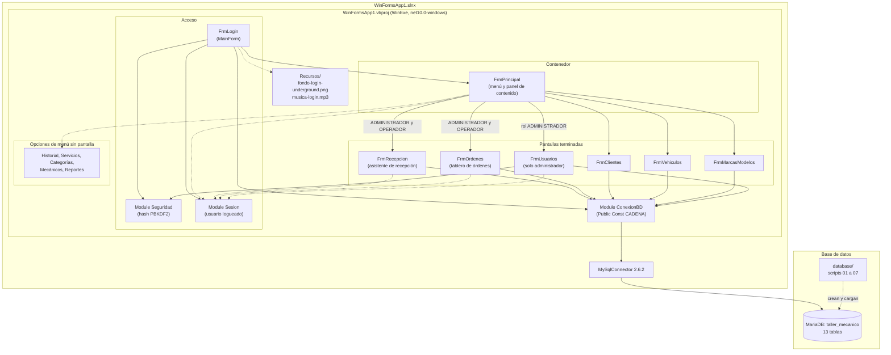
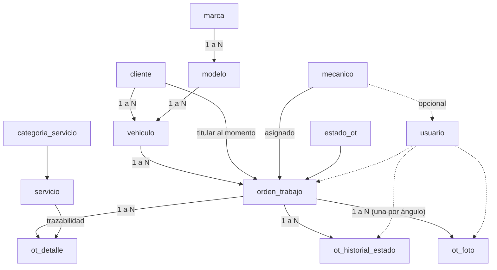
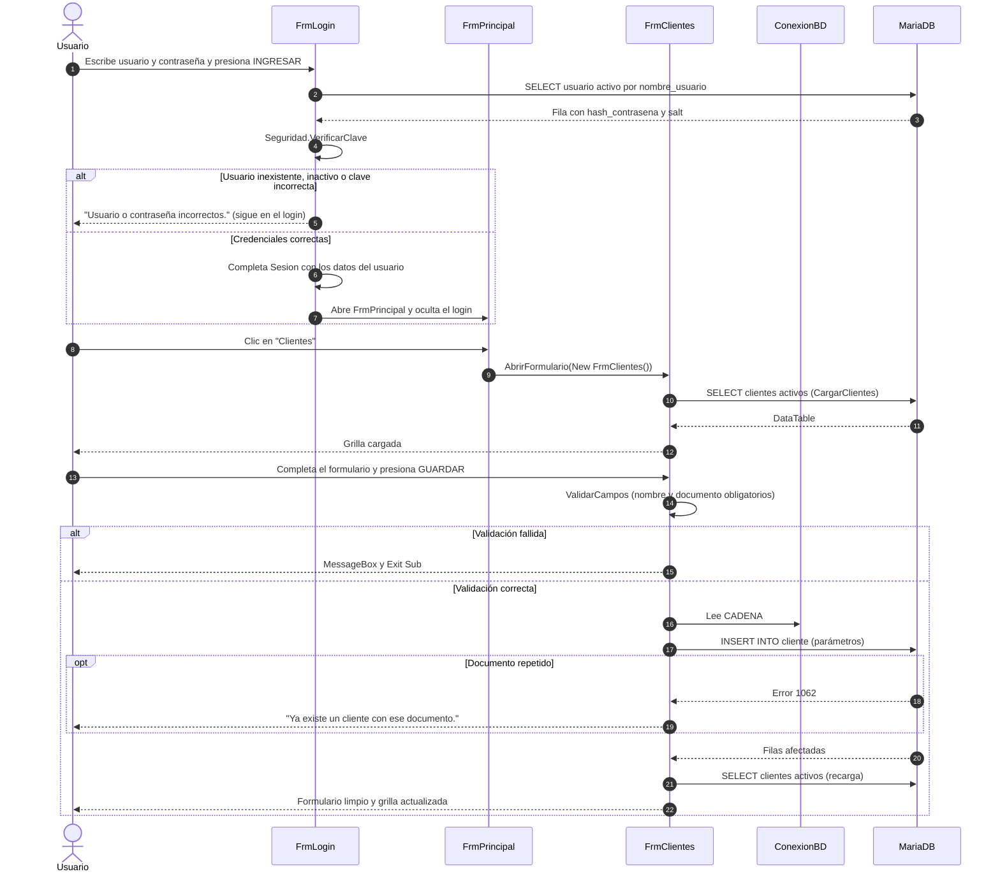

# WinFormsApp1 (Taller Mecánico) — Documentación técnica

<!-- Lo delimitado por @tsg-docs:auto-start/auto-end se regenera automáticamente. Editar fuera de esos bloques. -->

---

## Qué es

Aplicación de escritorio Windows Forms (VB.NET, .NET 10) conectada a una base MariaDB, que administra los servicios de un taller mecánico. Es un trabajo práctico universitario. El alcance acordado con la cátedra el 27/08 cubre solo la actividad de **servicios**: queda fuera la facturación, los pagos, la venta de insumos y el control de stock (`taller-mecanico-especificacion.md`, sección 2).

Repositorio: https://github.com/MedinaLucas1996/taller-mecanico (público).

## Cómo funciona

- El proyecto de inicio es `FrmLogin` (`MainForm` en `My Project/Application.myapp`). Muestra una imagen de fondo y reproduce música en bucle, ambas desde `WinFormsApp1/Recursos/`. El botón INGRESAR (también con Enter) valida que usuario y contraseña no estén vacíos, busca el usuario activo en `usuario` por `nombre_usuario` y verifica la contraseña con `Seguridad.VerificarClave`. Si el usuario no existe, está inactivo o la clave es incorrecta, muestra el mismo mensaje ("Usuario o contraseña incorrectos."), limpia la contraseña y permanece en el login. Si es correcto, completa el `Module Sesion` (`IdUsuario`, `NombreUsuario`, `NombreCompleto`, `Rol`, `IdMecanico`, este último en 0 si el usuario no es mecánico), abre `FrmPrincipal`, detiene la música y oculta el login.
- `Module Seguridad` implementa el hash de contraseñas con PBKDF2 + SHA256 (100000 iteraciones, hash de 32 bytes, salt aleatorio de 16 bytes, ambos en Base64): `GenerarSalt`, `HashearClave` y `VerificarClave` (comparación en tiempo constante; devuelve `False` si el hash o el salt guardados no son Base64 válido, por ejemplo un hash BCrypt anterior). `Module Sesion` guarda los datos del usuario que inició sesión y tiene `CerrarSesion`.
- `FrmPrincipal` está armado en el diseñador (`FrmPrincipal.Designer.vb`), con manejadores `Handles`: menú lateral, barra superior y un panel de contenido. Las pantallas se abren dentro del panel con `AbrirFormulario` (`TopLevel = False`, `Dock = Fill`). Antes de abrir una, `CerrarPantallaActual` llama a `Close()` sobre la pantalla que estaba abierta: eso dispara su `FormClosing`, y si la pantalla no lo cancela queda liberada y sale del panel. Si lo cancela (hoy solo `FrmClientes`, cuando hay cambios sin guardar y el usuario no los descarta), la pantalla nueva no se abre. "Cerrar sesión" y el cierre de la ventana principal (`FrmPrincipal_FormClosing`) usan la misma rutina, y ninguno pregunta dos veces. Al cerrar `FrmPrincipal` se llama a `Application.Exit()`, salvo cuando se cierra por el botón "Cerrar sesión". La barra superior muestra el nombre completo y el rol del usuario de `Sesion`, y a su derecha el botón "Cerrar sesión": pide confirmación, limpia `Sesion` con `CerrarSesion()`, llama a `FrmLogin.PrepararNuevoIngreso()` (vacía usuario y contraseña, vuelve a mostrar el login y reinicia la música) y cierra `FrmPrincipal`. Al ingresar otro usuario se crea un `FrmPrincipal` nuevo, por lo que el menú se muestra según el rol de ese usuario.
- El menú se filtra por rol. Los botones del menú y los tres títulos de sección tienen `Visible = False` en el diseñador, y `FrmPrincipal_Load` muestra los que corresponden con un bloque `If Sesion.Rol = "..." Then` por rol (ver [Menú por rol](#menú-por-rol)). Un rol desconocido no ve ninguna opción del menú.
- Menú lateral (`panelMenu`, acoplado a la izquierda): tiene tres paneles declarados en el diseñador.
  - `panelLogo` (arriba): el botón `btnMenu`, que contrae y expande el menú, y el nombre del sistema.
  - `panelMenuArriba` (arriba): Operaciones (Recepción, Órdenes de trabajo, Historial) y Reportes, cada título sobre sus botones.
  - `panelMenuAbajo` (acoplado al borde inferior): Datos maestros (Clientes, Vehículos, Marcas y modelos, Servicios, Categorías, Mecánicos, Usuarios). Sus botones se acoplan hacia abajo, de modo que las opciones ocultas por rol no dejan huecos y el espacio libre queda entre Reportes y Datos maestros.
  - Iconos: `LeerIcono` lee en `FrmPrincipal_Load` cada PNG de `Recursos\iconos` junto al ejecutable (el proyecto los copia a la carpeta de salida con `Recursos\iconos\*`). Si un archivo falta o no se puede leer, el botón queda sin icono. Los iconos provienen de Lucide (licencia ISC, texto en `Recursos/iconos/LICENCIA-lucide.txt`).
  - Contraer y expandir: `AplicarMenu` cambia el ancho del menú entre 230 y 56. Contraído oculta los títulos de sección y el nombre del sistema, deja en cada botón solo el icono centrado y le asigna su nombre como tooltip (`tipMenu`); un botón sin icono muestra su inicial. El nombre de cada opción se guarda una sola vez, en el `Tag` del botón. Como el panel de contenido está acoplado con `Fill`, ocupa el ancho que el menú libera. El estado no se guarda: el menú arranca siempre expandido.
  - Títulos de sección: un título se muestra solo con el menú expandido y cuando el rol tiene al menos una opción en esa sección.
- Cada pantalla terminada abre su propia conexión con `Using cn As New MySqlConnection(CADENA)` dentro del evento correspondiente, ejecuta una consulta parametrizada y vuelca el resultado a la grilla con `DataTable.Load`. `CADENA` es una constante del `Module ConexionBD`.
- Pantallas terminadas:
  - **Clientes** (`FrmClientes`): pantalla modelo de los datos maestros, con la lista a la izquierda y el registro a la derecha. Alta, modificación, baja lógica (`activo = 0`) y reactivación; nombre y documento obligatorios; el error 1062 de MariaDB se traduce al mensaje "Ya existe un cliente con ese documento"; la baja se rechaza si el cliente tiene vehículos activos.
    - Disposición: los controles usan `Anchor`. La tarjeta de la lista (`pnlLista`) se estira en los dos sentidos; la del registro (`pnlFicha`) tiene ancho fijo, queda a la derecha y se estira a lo alto, con sus botones anclados abajo. Los campos están en un `TableLayoutPanel` (`tlpCampos`) de dos columnas al 40 % y 60 % (la segunda, más ancha, lleva teléfono y correo) y filas de alto automático, con una etiqueta chica sobre cada caja; la fila de "Observaciones" ocupa el alto que sobra. La etiqueta de estado va en su propio renglón, debajo del título del registro. La grilla no tiene marco ni líneas verticales: solo una línea clara entre filas y otra debajo del encabezado.
    - Lista: búsqueda en vivo por nombre o documento (`txtFiltro_TextChanged`), casilla "Mostrar dados de baja" y grilla con nombre, documento, teléfono y localidad. Los dados de baja van al final y en gris: `dgvClientes_DataBindingComplete` lee la columna oculta `activo`. El subtítulo cuenta lo listado. La fila marcada es siempre la del registro abierto: `MarcarFila(id)` pone juntas la celda actual y la selección, o las quita si no hay registro abierto o no está listado. El orden por columna lo hace el formulario (`dgvClientes_ColumnHeaderMouseClick`, columnas en `SortMode = Programmatic`) con `cargando` en True, y `dgvClientes_Sorted` vuelve a marcar la fila: ordenar no cambia el registro abierto ni pregunta nada. Tab sale de la grilla (`StandardTab = True`). El ID no se muestra: está en una columna oculta y en la variable `idCliente`.
    - Registro: `MostrarAyuda`, `MostrarRegistro` y `NuevoRegistro` dejan la tarjeta en uno de tres modos (ayuda, edición, alta) y muestran solo los botones de ese modo: "Guardar cambios" con "Dar de baja" o "Reactivar", o "Guardar" con "Cancelar". En edición se ve la etiqueta de estado y una línea con la cantidad de vehículos activos y la fecha de alta.
    - Selección: la fila se carga tanto por `SelectionChanged` (mouse o teclado) como por `CellClick`; después de cada recarga la lista vuelve a marcar al cliente que se estaba viendo, y si ya no está listado la tarjeta vuelve a la ayuda.
    - Cambios sin guardar: al cambiar un campo se marca `hayCambios`; elegir otra fila, "Nuevo cliente", "Cancelar" y salir de la pantalla (`FrmClientes_FormClosing`) preguntan antes de descartarlos; si se contesta que no, la lista vuelve a marcar el registro que se estaba editando. La baja y la reactivación avisan en su propia confirmación que esos cambios se pierden, y solo los descartan cuando el cambio de estado se guardó. Todo lo que pone `cargando` en True lo devuelve en un `Finally`.
  - **Vehículos** (`FrmVehiculos`): alta, modificación, baja lógica y reactivación; la baja se rechaza si el vehículo tiene una orden de trabajo en un estado no final, y la reactivación si su titular está dado de baja; combo de titular (clientes activos, más el titular del propio vehículo cuando está dado de baja, que se lista como "Nombre (dado de baja)" para que el combo no quede vacío; un cliente dado de baja no se puede elegir para otro vehículo); combos de marca y modelo en cascada (el modelo se recarga al cambiar la marca); búsqueda por patente, titular, marca o modelo; el error 1062 se traduce al mensaje de patente duplicada. La lista muestra patente, marca y modelo, titular y año; la tarjeta agrega una línea con la cantidad de órdenes de trabajo del vehículo y la fecha de la última.
  - **Marcas y modelos** (`FrmMarcasModelos`): maestro-detalle en dos tarjetas iguales: "Marcas" a la izquierda (grilla con la cantidad de modelos) y "Modelos de <marca>" a la derecha, que solo muestra su lista cuando hay una marca elegida. Cada tarjeta tiene arriba su botón "Nueva marca" / "Nuevo modelo" y al pie una caja para el nombre con "Guardar" (alta) o "Guardar cambios" y "Eliminar" (con una fila elegida). Usa el mismo aspecto de grilla y la misma rutina `MarcarFila` que el resto, sin ID a la vista. No tiene búsqueda ni baja lógica, igual que antes; la baja es **física** (`DELETE`) y el error 1451 de clave foránea se traduce a un mensaje ("la marca tiene modelos cargados" o "hay vehículos cargados con ese modelo").
  - **Usuarios** (`FrmUsuarios`, solo administrador): alta, modificación, baja lógica (`activo = 0`) y reactivación, con confirmación; la grilla lista usuario, nombre completo, rol y mecánico asociado, y nunca lee `hash_contrasena` ni `salt`; búsqueda en vivo por usuario o nombre completo. Al crear, la contraseña es obligatoria y se guarda con `Seguridad.GenerarSalt` + `Seguridad.HashearClave`; al modificar, una contraseña vacía conserva la actual y una contraseña escrita genera un salt y un hash nuevos. El combo de rol (`ADMINISTRADOR`, `OPERADOR`, `MECANICO`) habilita el combo de mecánico solo para `MECANICO` y ese rol exige elegir un mecánico; para los demás roles `id_mecanico` se guarda como NULL (regla 8.6, respaldada por el CHECK `val_usuario_rol_mecanico`). El error 1062 se traduce al mensaje de nombre de usuario duplicado, que puede corresponder a un usuario dado de baja. Reglas de autoprotección: el usuario logueado no puede darse de baja ni cambiar su propio rol (la tarjeta lo avisa en una línea cuando se abre el propio usuario), y si modifica su propio usuario se actualizan `Sesion.NombreUsuario` y `Sesion.NombreCompleto`. Como respaldo del menú, al abrirse con un rol distinto de `ADMINISTRADOR` muestra un aviso y deshabilita el formulario.
  - Modelo común de Vehículos, Usuarios, Mecánicos, Servicios y Categorías: repiten la pantalla de Clientes con los mismos nombres. Cabecera con el botón "Nuevo …"; tarjeta de lista (búsqueda en vivo, casilla "Mostrar dados de baja" y grilla sin ID, con los dados de baja al final y en gris, sin columna "Activo"); tarjeta de registro con título, etiqueta de estado, campos en `tlpCampos`, línea de contexto y acciones al pie. Los tres modos (ayuda, edición, alta) reemplazan a los botones Guardar / Modificar / Limpiar. Rutinas: `Cargar…`, `MarcarFila`, `RefrescarRegistro`, `MostrarAyuda`, `CargarCampos`, `MostrarRegistro`, `NuevoRegistro`, `DescartarCambios`, `ElegirFila`, `ValidarCampos`; manejadores: `Load`, `Shown`, `FormClosing`, filtro, casilla, `DataBindingComplete`, `ColumnHeaderMouseClick` (orden programado con `cargando` en True), `Sorted`, `SelectionChanged`, `CellClick`, cambios de campos, nuevo, cancelar, guardar y baja. Un registro inactivo se puede abrir y modificar. La baja y la reactivación piden una sola confirmación, que avisa si hay cambios sin guardar, y usan en las seis pantallas la misma transacción (también en Mecánicos, que antes decidía con el estado de la pantalla): se vuelve a leer `activo` bloqueando solo esa fila, no se guarda nada si otro puesto ya cambió el estado, y `Commit` va después del bloque que hace el `Rollback`. En Usuarios, además, no se puede dar de baja el propio usuario ni al único administrador activo, y un usuario de rol `MECANICO` no se reactiva si su mecánico asociado está dado de baja.
  - **Servicios** (`FrmServicios`, solo administrador): alta, modificación, baja lógica y reactivación sobre la tabla `servicio`. Como respaldo del menú, al abrirse con un rol distinto de `ADMINISTRADOR` muestra un aviso y deshabilita el formulario.
    - Campos: código (obligatorio, hasta 30 caracteres, se guarda sin espacios sobrantes y en mayúsculas), descripción (obligatoria, hasta 200), categoría (obligatoria), precio (obligatorio, dos decimales, puede ser cero) y tiempo estimado en horas (opcional, hasta 999,99; con la casilla sin marcar se guarda como NULL).
    - Categoría: el combo lista las categorías activas por nombre. Si el servicio seleccionado tiene una categoría dada de baja, esa categoría se agrega al combo marcada como "(inactiva)".
    - Grilla: código, descripción, categoría, precio (moneda, a la derecha) y horas. Búsqueda en vivo por código, descripción o categoría. La tarjeta avisa en una línea cuando la categoría del servicio está dada de baja.
    - Código repetido: lo impide la restricción única `un_servicio_codigo`; el error 1062 se traduce a un mensaje, que aclara que el código puede ser de un servicio dado de baja.
    - Baja y reactivación: el mismo botón dice "Dar de baja" o "Reactivar" según el servicio seleccionado, y ambos piden confirmación. Dentro de una transacción se vuelve a leer el servicio con bloqueo; si otro puesto ya le cambió el estado no se guarda nada. La baja no comprueba si el servicio está en uso, porque cada línea de presupuesto guarda su propia copia de la descripción y del precio. La reactivación se rechaza si la categoría del servicio está dada de baja.
  - **Categorías** (`FrmCategorias`, solo administrador): alta, modificación, baja lógica y reactivación sobre la tabla `categoria_servicio`. Como respaldo del menú, al abrirse con un rol distinto de `ADMINISTRADOR` muestra un aviso y deshabilita el formulario.
    - Campo: descripción (obligatoria, hasta 60 caracteres, se guarda sin espacios sobrantes).
    - Grilla: descripción y cantidad de servicios activos, que la tarjeta repite en una línea. Búsqueda en vivo por descripción.
    - Descripción repetida: la impide la restricción única `un_categoria_servicio_descripcion`; el error 1062 se traduce a un mensaje, que aclara que puede ser de una categoría dada de baja.
    - Baja y reactivación: el mismo botón dice "Dar de baja" o "Reactivar" según la categoría seleccionada, y ambos piden confirmación. Dentro de una transacción se vuelve a leer la categoría con bloqueo; si otro puesto ya le cambió el estado no se guarda nada. La baja se rechaza, indicando la cantidad, si la categoría tiene servicios activos. La reactivación no tiene condiciones.
  - **Mecánicos** (`FrmMecanicos`, solo administrador): alta, modificación, baja lógica y reactivación sobre la tabla `mecanico`. Como respaldo del menú, al abrirse con un rol distinto de `ADMINISTRADOR` muestra un aviso y deshabilita el formulario.
    - Campos: nombre completo (obligatorio, hasta 100 caracteres), especialidad (hasta 80) y teléfono (hasta 30); los dos últimos, si quedan vacíos, se guardan como NULL.
    - Grilla: nombre, especialidad y teléfono. Búsqueda en vivo por nombre o especialidad. La tarjeta muestra en una línea cuántas órdenes de trabajo sin cerrar tiene asignadas.
    - Nombre repetido: no se guarda ni se modifica un mecánico con el nombre de otro mecánico activo (se compara sin espacios sobrantes y sin distinguir mayúsculas).
    - Baja y reactivación: con un mecánico activo seleccionado el botón dice "Dar de baja" y, con uno dado de baja, "Reactivar"; ambos piden confirmación. La baja (`activo = 0`) se rechaza si el mecánico tiene órdenes de trabajo en un estado no final; la comprobación y el cambio se hacen en una transacción que vuelve a leer `activo` bloqueando la fila y no guarda nada si otro puesto ya cambió el estado.
  - **Recepción** (`FrmRecepcion`, administrador y operador): asistente de cuatro pasos en un solo formulario, con un panel por paso. Sus controles usan `Anchor`, por lo que sigue el tamaño del panel de contenido. Volver a un paso anterior no pierde lo cargado.
    - Barra de pasos (`tlpPasos`, cuatro celdas iguales): `PintarPaso` dibuja el paso actual resaltado, los completos con una marca en lugar del número y los que faltan atenuados. Un clic en un paso completo vuelve a él; un clic en un paso posterior no hace nada, porque hacia adelante siempre se avanza con "Siguiente", que valida cada paso.
    - Resumen (`pnlResumen`, a la derecha, siempre visible): `ActualizarResumen` muestra el vehículo y el cliente desde que se encuentra la patente, los datos de ingreso una vez superado el paso 2, y la cantidad de fotos "n de 5"; lo que todavía no se cargó figura con un guion. Se actualiza al cambiar de paso, al buscar o cambiar la patente y al cargar o quitar una foto.
    - Pie: "Cancelar" (pide confirmación si hay algo cargado y reinicia el asistente), "Anterior" (oculto en el paso 1) y el botón principal, "Siguiente" en los pasos 1 a 3 y "Confirmar recepción" en el paso 4.
    - Iconos: los botones, la marca de paso completo, las filas del resumen y los cuadros de fotos usan iconos PNG de `Recursos\iconos`, leídos al abrir con `LeerIcono`; si un archivo falta, ese control queda sin icono.
    1. *Vehículo*: búsqueda por patente exacta. Si la patente no existe, el paso muestra un aviso con el botón "Registrar vehículo", que abre `FrmAltaRapida`; al registrarse, el asistente vuelve a ejecutar la misma búsqueda con esa patente (`btnBuscar.PerformClick`). Un vehículo dado de baja muestra un mensaje y no ofrece el registro. Al encontrarlo muestra una tarjeta con marca y modelo, año, color, kilometraje actual, titular y las órdenes anteriores del vehículo. No deja avanzar mientras la patente no esté registrada, ni si el vehículo está dado de baja, ni si ya tiene una orden en un estado no final.
    2. *Datos de ingreso*: kilometraje de ingreso (no menor al `km_actual` del vehículo ni al mayor `km_ingreso` de sus órdenes, regla 8.3), nivel de combustible, síntoma reportado (obligatorio), observaciones de recepción, mecánico (opcional) y fecha prometida de entrega (opcional; si se indica, no puede ser anterior a hoy).
    3. *Fotos*: cinco cuadros en una fila (frente, trasera, lateral izquierdo, lateral derecho y tablero), cada uno con vista previa, "Cargar foto" y, cuando tiene foto, "Quitar". El cuadro vacío se dibuja con borde punteado y también carga la foto con un clic. Una línea indica cuántas hay cargadas ("Cargadas n de 5"). Se eligen archivos JPG o PNG del disco; la foto se endereza según su orientación EXIF y se reduce a 1280 píxeles en su lado mayor. Las fotos son opcionales.
    4. *Confirmación*: detalle completo de solo lectura, con los textos largos y las miniaturas de las fotos cargadas. Al confirmar, si faltan fotos se pregunta si se continúa igual, y luego se guardan en una sola transacción la orden (`nro_orden` siguiente, estado `RECEPCIONADA`, el titular de ese momento como cliente de la orden y `Sesion.IdUsuario` como usuario de alta), la primera fila de `ot_historial_estado` y una fila de `ot_foto` por cada foto cargada, en JPEG. Si algo falla no se guarda nada. La recepción no modifica `vehiculo.km_actual`.
  - **Registro rápido** (`FrmAltaRapida`, administrador y operador): ventana modal que da de alta el vehículo de una patente no registrada y, si hace falta, a su titular. Se abre solo desde el paso 1 de la recepción.
    - Titular: cliente ya registrado (búsqueda en vivo por documento o nombre sobre clientes activos, se elige con un clic) o cliente nuevo (nombre o razón social y documento obligatorios, teléfono opcional), una de las dos opciones.
    - Vehículo: patente (precargada, en mayúsculas, editable), marca y modelo en combos en cascada, año opcional (1900 a 2100) y color opcional. No crea marcas ni modelos.
    - Guardado: una transacción inserta el cliente, si es nuevo, y el vehículo con ese titular y `km_actual` 0. Antes vuelve a leer con bloqueo que el cliente elegido siga activo y comprueba que el modelo exista. Los opcionales vacíos se guardan como NULL.
    - Devuelve la patente guardada en el campo público `Patente`. El registro queda guardado aunque la recepción se cancele después.
  - **Órdenes de trabajo** (`FrmOrdenes`, administrador y operador): tablero; no escribe en la base. Sus controles usan `Anchor`, por lo que el tablero sigue el tamaño del panel de contenido: las tarjetas y los filtros se estiran a lo ancho, la grilla en los dos sentidos y la tarjeta de detalle queda a la derecha con ancho fijo.
    - Título: el subtítulo indica cuántas órdenes están listadas y cuántas de ellas están demoradas.
    - Tarjetas de estado: ocho tarjetas declaradas en el diseñador dentro de un `TableLayoutPanel` de ocho columnas iguales. `CargarTarjetas` asigna a cada una un estado de `estado_ot` en el orden de `orden_flujo`, con su cantidad de órdenes, incluidos los estados sin órdenes (número atenuado). Cuentan siempre todas las órdenes y no aplican los filtros. Un clic en una tarjeta filtra la lista por ese estado y la resalta; otro clic en la misma tarjeta quita el filtro. Reemplazan a la grilla de resumen y al combo de estado.
    - Filtros: texto contenido en la patente o en el nombre del cliente, que se aplica mientras se escribe, y casilla "Solo demoradas". "Limpiar filtros" los reinicia, quita el estado elegido y recarga. No hay botón "Buscar".
    - Grilla: una fila por orden, la más reciente primero, con número, fecha y hora de recepción, patente, vehículo (marca y modelo), cliente de la orden (`orden_trabajo.id_cliente`, no el titular actual del vehículo), mecánico ("Sin asignar" si no tiene), estado, fecha prometida y situación. Vehículo, cliente y mecánico se reparten el ancho disponible. La celda del estado se colorea según `estado_ot.codigo`, que la consulta trae en una columna oculta (`ColorEstado`).
    - Demoradas: una orden está demorada cuando su `fecha_prometida` es anterior a hoy y su estado no es final (`estado_ot.es_estado_final = 0`). La columna de situación dice "Demorada" y la fila se muestra con fondo rojo suave.
    - Detalle: al seleccionar una orden con el mouse o con el teclado, la tarjeta de la derecha muestra número, estado, patente y vehículo, cliente, mecánico, fecha de recepción, fecha prometida y total presupuestado, tomados de la fila de la grilla. Sin orden seleccionada muestra solo una ayuda y oculta el resto, incluido el botón "Gestionar orden".
    - Fotos: al seleccionar una orden se leen de `ot_foto` solo las fotos de esa orden y se muestran en cinco miniaturas, una por ángulo; el ángulo sin foto muestra "Sin foto". La consulta de la grilla nunca lee la columna `imagen`. Un clic en una miniatura con foto la abre ampliada en `FrmFoto`, una ventana modal con el ángulo como título.
    - Carga de fotos después de la recepción: el estado de la orden seleccionada (columnas ocultas `codigo_estado` y `estado_final` de la grilla) decide qué se puede hacer.
      - Agregar: con la orden en un estado no final, la miniatura vacía se dibuja con borde punteado, cámara y "Cargar foto" (`Foto_Paint`); un clic abre el diálogo de archivo y `AgregarFoto` inserta la fila en `ot_foto`. En un estado final la miniatura vacía solo dice "Sin foto".
      - Reemplazar o quitar: con la orden en `RECEPCIONADA`, `FrmFoto` muestra una barra con "Reemplazar foto" (`UPDATE` de `imagen`, `id_usuario` y `fecha_hora`) y "Quitar foto" (`DELETE` de esa fila, con confirmación). En cualquier otro estado la barra no aparece.
      - Cada escritura es una transacción que primero bloquea la fila de la orden (`SELECT ... FOR UPDATE` sobre `orden_trabajo`) y vuelve a leer su estado; si ya no permite la acción no se guarda nada, se avisa y el tablero se recarga.
      - El tablero pasa a `FrmFoto` la orden, el ángulo y si se permiten cambios en campos públicos, y lee `HuboCambios` al cerrarse para recargar.
    - Proceso de imagen compartido: `Module Fotos` (`Fotos.vb`) tiene `CargarImagenReducida`, `ImagenABytes`, `LeerFotoComoJpeg` y `LeerIcono`. Lo usan `FrmRecepcion`, `FrmOrdenes` y `FrmFoto`, de modo que las fotos se procesan igual en la recepción y en el tablero.
    - "Gestionar orden": abre `FrmOrdenGestion` como ventana modal (`ShowDialog`) y, al cerrarla, recarga las tarjetas y la grilla. La orden queda seleccionada si sigue en la lista; si un filtro la deja fuera, el detalle vuelve a la ayuda.
  - **Gestión de la orden** (`FrmOrdenGestion`, administrador y operador): ventana modal, redimensionable, que lleva una orden desde `RECEPCIONADA` hasta `ENTREGADA`. Recibe la orden en el campo público `IdOrdenTrabajo`. Se organiza por etapa: `CargarOrden` lee la orden y su estado y `MostrarEtapa` deja a la vista solo las partes que usa ese estado; las dos se vuelven a ejecutar después de cada guardado.
    - Cabecera: "Orden N.º n · patente vehículo", el estado a la derecha con el mismo color que en el tablero, y debajo el cliente y la fecha prometida.
    - Barra de etapas (`tlpEtapas`, seis celdas iguales, solo informativa): `PintarEtapa` marca en verde las etapas cumplidas, resalta la actual y atenúa las que faltan. La etapa más avanzada se toma del historial, de modo que una orden `RECHAZADA` o `ANULADA` conserva marcadas las etapas que alcanzó, sin ninguna resaltada, y debajo de la barra se lee "Orden rechazada" u "Orden anulada" con el motivo guardado en el historial.
    - Área de trabajo (`pnlTrabajo`): una sola grilla de líneas, con columnas declaradas en el diseñador, y paneles acoplados que se muestran según el estado: el editor del presupuesto (servicio, cantidad, "Agregar"), los botones "Actualizar cantidad" y "Quitar" con los totales, el aviso del mecánico y las observaciones del mecánico. Cada etapa tiene un título y una frase que dice qué hacer.
    - Datos de la orden (a la derecha): mecánico (combo con "(sin asignar)" y "Guardar mecánico" mientras el estado no es final; después, solo el nombre), kilometraje de ingreso, fecha de recepción, síntoma, observaciones de recepción, y las fechas de finalización y de entrega cuando existen.
    - Historial (a la derecha): lista de `ot_historial_estado`, el cambio más reciente primero; cada fila se dibuja en dos renglones (`dgvHistorial_CellPainting`): el estado, y debajo fecha, usuario y nota en gris.
    - Pie: "Anular orden" (solo `ADMINISTRADOR`, en un estado no final), la leyenda "Próximo paso", un botón secundario cuando la etapa lo tiene y un único botón principal (`btnPrimario`) cuyo texto es el próximo paso; en un estado final dice "Cerrar".

    | Estado | Área de trabajo | Principal | Secundario |
    |---|---|---|---|
    | `RECEPCIONADA` | Editor del presupuesto y total presupuestado. Cada cambio recalcula `total_presupuestado` y `total_aprobado` en la misma transacción. | "Presupuestar": exige al menos una línea. | — |
    | `PRESUPUESTADA` | El mismo editor más la columna "Aprobado", editable; contador "Aprobadas n de m" y total aprobado según las tildes. Las tildes hechas se conservan si se agrega, quita o cambia una línea o se guarda el mecánico. | "Registrar aprobación": exige al menos una línea aprobada, pide confirmación con el total y guarda las tildes y los totales. | "Rechazar": pide confirmación, deja todas las líneas sin aprobar. |
    | `APROBADA` | Líneas de solo lectura con su aprobación, totales, y el mecánico asignado o un aviso si falta. | "Iniciar trabajo": exige un mecánico. | — |
    | `EN_PROCESO` | Solo las líneas aprobadas, con "Cantidad" y "Horas trabajadas"; las horas se editan en la grilla (dos decimales, no negativas, hasta 999,99; un valor inválido se rechaza con un mensaje y la celda conserva el anterior). Marca de lista o pendiente por línea según tenga horas, contador "Faltan horas en n de m" y observaciones del mecánico. | "Finalizar trabajo": guarda lo cargado y finaliza en la misma transacción; exige las horas trabajadas en todas las líneas aprobadas y las observaciones. Guarda `fecha_finalizacion = NOW()`. | "Guardar avance": guarda las horas de cada línea (`horas_reales`, NULL si la celda está vacía) y `observaciones_mecanico`, sin cambiar el estado ni el historial. No escribe `cantidad_real`. |
    | `FINALIZADA` | Resumen de solo lectura: líneas aprobadas con cantidad, precio, subtotal y horas trabajadas, observaciones del mecánico y total aprobado. | "Entregar vehículo": pide confirmación, guarda `fecha_entrega = NOW()` y sube `vehiculo.km_actual` al `km_ingreso` de la orden cuando es mayor. | — |
    | `ENTREGADA`, `RECHAZADA`, `ANULADA` | El mismo resumen. | "Cerrar". | — |

    - "Guardar avance" y "Finalizar trabajo" comparten la rutina `GuardarEjecucion`, que escribe dentro de la transacción de cada botón. Si hay avance escrito sin guardar, cerrar la ventana pide confirmación y "Guardar mecánico" pide guardarlo antes.
    - Anulación: "Anular orden" abre `FrmAnularOrden`, una ventana modal que explica la acción y pide el motivo (obligatorio, hasta 255 caracteres). Esa ventana no toca la base: devuelve el motivo y la anulación se hace en `FrmOrdenGestion`, con el motivo como observación del historial. No borra ninguna fila.
    - Cada escritura vuelve a leer el estado dentro de su transacción bloqueando solo la fila de la orden (`LeerCodigoEstado`), y confirma con `Commit` después del bloque que hace el `Rollback` ante un error.

- Pendiente en el flujo de la orden de trabajo: vista del mecánico e impresión del presupuesto o de la comanda de taller.
- Opciones de menú sin pantalla (el botón existe pero no tiene evento): Historial y Reportes.

### Menú por rol

Opciones del menú principal que ve cada rol (`FrmPrincipal_Load`):

| Opción del menú | ADMINISTRADOR | OPERADOR | MECANICO |
|---|---|---|---|
| Recepción | Sí | Sí | No |
| Órdenes de trabajo | Sí | Sí | No |
| Historial | Sí | Sí | Sí |
| Clientes | Sí | Sí | No |
| Vehículos | Sí | Sí | No |
| Marcas y modelos | Sí | Sí | No |
| Servicios | Sí | No | No |
| Categorías | Sí | No | No |
| Mecánicos | Sí | No | No |
| Usuarios | Sí | No | No |
| Reportes | Sí | No | No |

Los títulos de sección siguen la misma regla: "OPERACIONES" se muestra a todos los roles, "DATOS MAESTROS" al administrador y al operador, y "REPORTES" solo al administrador. Como las opciones ocultas no ocupan lugar, el menú de cada rol queda sin huecos.

## Por qué existe

Es un trabajo práctico universitario que sigue el estilo de programación orientada a eventos de la cátedra. El dominio (cliente, vehículo, orden de trabajo, presupuesto) genera de forma natural las relaciones que justifican un modelo relacional, y la consigna exige una aplicación de escritorio en dos capas con salida impresa (el presupuesto). La especificación funcional completa está en `taller-mecanico-especificacion.md`.

---

<!-- @tsg-docs:auto-start -->

## Arquitectura general

### Diagrama de paquetes

### Stack técnico

| Capa | Tecnología |
|---|---|
| Lenguaje | VB.NET |
| Plataforma | .NET 10 (`net10.0-windows`), Windows Forms, `OutputType` WinExe |
| Patrones | Programación orientada a eventos con SQL dentro de los formularios; un único proyecto; sin DAO ni capas (ver [Decisiones técnicas](#decisiones-técnicas)) |
| Infraestructura | Cliente de escritorio de dos capas contra MariaDB (desarrollado con 12.2; el DDL indica 10.6 o superior), driver MySqlConnector 2.6.2 |

<!-- @tsg-docs:auto-end -->

---

## Modelo de dominio

El modelo tiene **13 tablas**. `taller-mecanico.dbml` describe las 12 del modelo original; la tabla `ot_foto` (fotos de recepción) y la columna `orden_trabajo.fecha_prometida` se agregaron después y están definidas en `database/01_ddl_estructura.sql` y en la sección 7 de `taller-mecanico-especificacion.md`, no en el archivo DBML. Los scripts de `database/` implementan el modelo sobre MariaDB con InnoDB, `utf8mb4` y todas las claves foráneas en `ON UPDATE RESTRICT`. Una base creada con la versión anterior de los scripts (12 tablas) debe ejecutar `database/07_recepcion_fotos.sql`, que agrega la columna y la tabla sin tocar los datos existentes.

| Grupo | Tablas |
|---|---|
| Seguridad | `usuario` (roles `ADMINISTRADOR`, `OPERADOR`, `MECANICO`; vínculo opcional con `mecanico`; `hash_contrasena` y `salt` en Base64 para PBKDF2) |
| Clientes y vehículos | `cliente`, `marca`, `modelo`, `vehiculo`, `mecanico` |
| Catálogo de servicios | `categoria_servicio`, `servicio` |
| Orden de trabajo y presupuesto | `estado_ot`, `orden_trabajo` (incluye `fecha_prometida`, fecha prometida de entrega, opcional), `ot_detalle`, `ot_historial_estado` |
| Fotos de recepción | `ot_foto` (orden, ángulo `FRENTE`, `TRASERA`, `LATERAL_IZQUIERDO`, `LATERAL_DERECHO` o `TABLERO`, imagen JPEG en `LONGBLOB`, usuario y fecha; una sola foto por orden y ángulo; se elimina junto con su orden) |

Relaciones principales:

Estados de la orden de trabajo (`database/02_dml_catalogos.sql`): `RECEPCIONADA`, `PRESUPUESTADA`, `APROBADA`, `EN_PROCESO`, `FINALIZADA`, `ENTREGADA`, `RECHAZADA`, `ANULADA`. Los estados llevan ID explícito (1 a 8). La recepción busca el estado inicial por su código (`RECEPCIONADA`), la gestión de la orden busca cada estado de destino también por su código, y el tablero de órdenes los lee de la tabla, ordenados por `orden_flujo`.

Estado de implementación: la aplicación opera hoy sobre `cliente`, `vehiculo`, `marca` y `modelo`; el login lee `usuario` y el ABM de Usuarios la escribe (y lee `mecanico` solo para llenar el combo de mecánicos). La recepción escribe `orden_trabajo`, `ot_historial_estado` y `ot_foto`, y el tablero de órdenes las lee junto con `estado_ot`. La gestión de la orden escribe `ot_detalle`, `orden_trabajo` (mecánico, estado, totales, observaciones del mecánico y fechas de finalización y entrega), `ot_historial_estado` y `vehiculo.km_actual`, y lee `servicio` y `mecanico`. El ABM de Mecánicos escribe `mecanico` y lee `orden_trabajo` y `estado_ot` para rechazar la baja de un mecánico con órdenes sin cerrar. El ABM de Servicios escribe `servicio` y lee `categoria_servicio`. El ABM de Categorías escribe `categoria_servicio` y lee `servicio` para contar los servicios activos de cada categoría y rechazar la baja de una categoría que los tenga.

Reglas de negocio relevantes de la especificación (sección 8):

- Precios y descripciones se **copian** al detalle de la orden al presupuestar (`ot_detalle`), para que cambiar la lista de precios no altere presupuestos ya emitidos.
- El titular de cada orden se guarda en `orden_trabajo.id_cliente`; cambiar el titular del vehículo no pierde el historial (esto ya se refleja en un comentario de `FrmVehiculos.btnGuardar_Click`).
- Aprobación parcial por línea (`ot_detalle.aprobado`); detalle congelado desde `APROBADA`.
- Las órdenes anuladas no se eliminan físicamente.

Reglas agregadas con la recepción y el tablero de órdenes:

- El kilometraje de ingreso no puede ser menor al `km_actual` del vehículo ni al mayor `km_ingreso` de sus órdenes anteriores (regla 8.3). `vehiculo.km_actual` no se actualiza en la recepción; la especificación lo actualiza en la entrega.
- Un vehículo con una orden en un estado no final no puede recepcionarse de nuevo.
- La fecha prometida de entrega es opcional y, si se indica, no puede ser anterior al día de la recepción.
- Las fotos de recepción son opcionales: una por ángulo, guardadas en la base como JPEG de hasta 1280 píxeles en su lado mayor.
- Una orden está demorada cuando su fecha prometida es anterior a hoy y su estado no es final (`estado_ot.es_estado_final = 0`).

Reglas agregadas con la gestión de la orden:

- "Presupuestar" es un paso explícito y exige al menos una línea. Una orden `PRESUPUESTADA` mantiene su detalle editable y no vuelve a `RECEPCIONADA`.
- El precio copiado del servicio no se edita en la línea. Un servicio va una sola vez por orden; para pedir más se cambia la cantidad. La cantidad admite dos decimales y debe ser mayor a cero.
- Subtotal de la línea = cantidad × precio unitario. `total_presupuestado` es la suma de los subtotales y `total_aprobado` la suma de los subtotales de las líneas aprobadas; los dos se escriben en un solo `UPDATE` por el CHECK `total_aprobado <= total_presupuestado`.
- La aprobación exige al menos una línea aprobada; si el cliente no aprueba ninguna, la orden se rechaza. `RECHAZADA` solo se alcanza desde `PRESUPUESTADA`.
- Para iniciar el trabajo la orden debe tener mecánico, y desde `EN_PROCESO` no puede quedar sin mecánico.
- Para finalizar, todas las líneas aprobadas deben tener sus horas trabajadas (hasta 999,99), y las observaciones del mecánico son obligatorias. La cantidad real no se registra: la columna `ot_detalle.cantidad_real` sigue en la base, pero la pantalla no la lee ni la escribe. Lo cargado se puede guardar antes con "Guardar avance", que no cambia el estado.
- La anulación es exclusiva del administrador, exige un motivo y se permite en cualquier estado no final, es decir, hasta `FINALIZADA`. La orden, sus líneas y su historial se conservan.
- Las fechas de finalización y de entrega son la fecha y hora del servidor (`NOW()`). En la entrega, `vehiculo.km_actual` toma el `km_ingreso` de la orden solo cuando es mayor al valor actual.

---

## Flujo principal

Alta de un cliente desde el menú principal (el flujo de las demás pantallas terminadas es análogo).

---

## Decisiones técnicas

| Decisión | Motivo | Fuente |
|---|---|---|
| Stack fijo: .NET 10 + VB.NET + MariaDB | Decisión del 2026-09-21. Descarta RDLC/ReportViewer, que solo funciona con .NET Framework. | `openspec/config.yaml` |
| Estilo de programación orientada a eventos de la cátedra, aplicado a propósito: `Module ConexionBD` con `Public Const CADENA`; formularios del diseñador con `Handles`; SQL dentro de los eventos con `Using cn` / `Using cmd`; grillas con `DataTable.Load`; parámetros con `AddWithValue`; validaciones que terminan en `Exit Sub`; comentarios cortos en español. | Es la convención obligatoria del curso. **No es** una arquitectura Hexagonal, MVC ni por capas. | `openspec/config.yaml` |
| Sin clases DAO ni proyecto de datos separado | La regla del estilo de cátedra reemplaza el apartado 3.2 de la especificación, que proponía `TallerMecanico.UI` y `TallerMecanico.Datos`. | `openspec/config.yaml`, `taller-mecanico-especificacion.md` |
| Driver MySqlConnector (no `MySql.Data`) | Mejor soporte asincrónico y compatibilidad con MariaDB. | `taller-mecanico-especificacion.md` (11.3), `WinFormsApp1.vbproj` |
| Baja lógica en clientes y vehículos (`activo = 0`) | Pueden tener órdenes de trabajo asociadas; no se borran. La baja se puede deshacer desde la misma pantalla ("Mostrar dados de baja" y "Reactivar"), porque el documento y la patente son únicos y el registro no se podría cargar de nuevo. | `FrmClientes.vb`, `FrmVehiculos.vb` |
| Baja lógica con reactivación en mecánicos; la grilla muestra también los dados de baja | Las órdenes de trabajo conservan a su mecánico, y un mecánico que vuelve al taller se reactiva sin cargarlo de nuevo. | `FrmMecanicos.vb` |
| Baja física en marcas y modelos | Son catálogos; la base impide borrar si hay dependencias (error 1451) y la aplicación lo traduce a un mensaje. | `FrmMarcasModelos.vb` |
| Claves foráneas con `ON UPDATE RESTRICT` | Desde MariaDB 10.5 una columna con FK en `CASCADE` no puede usarse en un `CHECK` (error 1901). | `database/01_ddl_estructura.sql` |
| Fotos de recepción guardadas en la base (`ot_foto.imagen`, `LONGBLOB`), reducidas a 1280 píxeles y en JPEG | La base queda completa por sí sola, sin una carpeta de archivos que mantener junto a ella; la reducción limita el tamaño de cada fila. El tablero de órdenes lee las imágenes solo de la orden seleccionada. | `database/01_ddl_estructura.sql`, `FrmRecepcion.vb`, `FrmOrdenes.vb` |
| Alta de la orden en una sola transacción (`BeginTransaction`) | La orden, su primera fila de historial y sus fotos se guardan todas o ninguna, como pide la especificación. | `FrmRecepcion.vb` |
| Cada cambio del presupuesto y cada cambio de estado en una transacción que vuelve a leer el estado de la orden con `SELECT ... FOR UPDATE` | Otro puesto puede haber cambiado la orden después de cargarla en pantalla; la lectura con bloqueo evita guardar sobre un estado que ya no es el esperado. La línea, los totales, el estado y la fila de historial se guardan todos o ninguno. | `FrmOrdenGestion.vb` |
| Rutinas del formulario que reciben la conexión y la transacción (`LeerCodigoEstado`, `PermiteEditarDetalle`, `EstadoEsFinal`, `RecalcularTotales`, `CambiarEstado`, `GuardarEjecucion`) | Evitan repetir en cada botón la lectura del estado, el recálculo de totales y el cambio de estado con su fila de historial. Son rutinas del propio formulario, no clases de acceso a datos. | `FrmOrdenGestion.vb` |
| Música del login con `winmm.dll` (`mciSendStringW`) | Permite reproducir un MP3 sin dependencias adicionales. | `FrmLogin.vb` |
| Recursos del login copiados al directorio de salida (`CopyToOutputDirectory`) | La imagen y la música se leen desde `AppContext.BaseDirectory\Recursos`. | `WinFormsApp1.vbproj`, `FrmLogin.vb` |

**Decisión cerrada: hash de contraseñas.** Se adopta PBKDF2 + SHA256 como la referencia de la cátedra (100000 iteraciones, hash de 32 bytes, salt de 16 bytes, ambos en Base64, salt en su propia columna `usuario.salt`), con las clases del propio .NET (`Rfc2898DeriveBytes`), sin paquetes adicionales. La sección 11.4 de `taller-mecanico-especificacion.md` todavía menciona BCrypt (`BCrypt.Net-Next`) y queda reemplazada por esta decisión (el archivo de la especificación no se modificó). Las bases ya cargadas con hashes BCrypt se migran con `database/06_migracion_hash_pbkdf2.sql`; una instalación nueva con los scripts 01 a 03 no la necesita.

**Decisión abierta: motor de reportes.** Se descartó RDLC; la opción .NET compatible (por ejemplo QuestPDF o FastReport Open Source, según `openspec/config.yaml`) queda sin elegir.

---

## Trade-offs evaluados

| Alternativa | Ventaja | Costo | Resultado |
|---|---|---|---|
| SQL dentro de los formularios (estilo de cátedra) | Código directo, fácil de seguir en el contexto del curso; coincide con la referencia de la cátedra. | Acopla interfaz y acceso a datos, repite consultas y manejo de errores entre formularios, y dificulta las pruebas automatizadas. | Adoptado, por requisito del curso. |
| Capa de acceso a datos con clases DAO (propuesta original de la especificación 3.2) | Separa responsabilidades y facilita probar. | Contradice el estilo exigido por la cátedra. | Descartado. |
| RDLC / ReportViewer | Diseñador visual integrado. | Requiere .NET Framework 4.8. | Descartado al fijar .NET 10. |
| Cadena de conexión como constante en código | Simple, idéntica a la referencia del curso. | Mezcla credenciales con el código y obliga a ajustes locales por desarrollador. | Adoptado; riesgo registrado en el checklist. |

---

## Edge cases

Casos manejados en el código:

- **Documento duplicado** (cliente), **patente duplicada** (vehículo), **marca duplicada** y **modelo duplicado dentro de la misma marca**: se captura `MySqlException` con número 1062 y se muestra un mensaje específico.
- **Borrado con dependencias** (marcas y modelos): se captura el error 1451 y se muestra un mensaje específico en lugar del error técnico.
- **Alta, modificación y baja**: las pantallas de datos maestros muestran solo los botones del caso (alta: "Guardar" y "Cancelar"; registro abierto: "Guardar cambios" y "Dar de baja" o "Reactivar"), por lo que ya no hay avisos de "use MODIFICAR" ni de "seleccione un registro".
- **Combos en cascada**: la opción "Seleccione una marca" (clave 0) vacía la lista de modelos y la validación rechaza la clave 0.
- **Año vacío en la base** al seleccionar un vehículo: se usa el año actual como valor por defecto.
- **Nombre de usuario duplicado** (usuarios): el error 1062 se traduce a un mensaje que aclara que puede corresponder a un usuario dado de baja; en ese caso se lo reactiva con "Mostrar dados de baja".
- **Baja con dependencias activas** (clientes, vehículos, usuarios): un cliente con vehículos activos, un vehículo con una orden sin cerrar y el único administrador activo no se dan de baja; el mensaje indica la cantidad o el número de orden.
- **Reactivación con el registro del que depende dado de baja** (vehículos, usuarios): un vehículo cuyo titular está inactivo y un usuario mecánico cuyo mecánico está inactivo no se reactivan; el mensaje nombra al cliente o al mecánico que hay que reactivar primero.
- **Vehículo dado de baja** (recepción): el mensaje indica que se lo puede reactivar en Vehículos con "Mostrar dados de baja".
- **Usuario logueado sobre sí mismo**: no puede darse de baja ni cambiar su rol a uno distinto de administrador.
- **Rol sin mecánico o mecánico con otro rol**: el rol `MECANICO` exige elegir un mecánico; el combo de mecánico se deshabilita y se reinicia con cualquier otro rol, y `id_mecanico` se guarda como NULL.
- **Contraseña vacía al modificar un usuario**: se conserva el hash y el salt actuales; la contraseña nunca se carga en el formulario.
- **Recursos del login ausentes o MP3 que no abre**: se muestra un mensaje y la aplicación continúa.
- **Patente inexistente** (recepción): el paso 1 lo avisa en pantalla y ofrece registrar el vehículo sin salir del asistente. **Vehículo inactivo o con una orden abierta** (recepción): cada caso muestra su mensaje y no deja pasar del paso 1. Si se cambia la patente después de buscar, el vehículo cargado se descarta.
- **Documento o patente repetidos** (registro rápido): el error 1062 se distingue por la restricción que nombra (`un_cliente_documento` o `un_vehiculo_patente`) y se traduce a un mensaje que indica buscar al cliente existente, o revisar el vehículo en Vehículos; en ambos casos se aclara que puede estar dado de baja. No se guarda nada.
- **Cliente dado de baja o modelo borrado mientras se cargaba** (registro rápido): se rechaza con un mensaje y no se guarda nada.
- **Kilometraje menor al mínimo, síntoma vacío o fecha prometida pasada** (recepción): se rechazan en el paso 2 y se vuelven a validar al confirmar.
- **Archivo que no es una imagen** (recepción): se avisa y el cuadro de la foto queda como estaba.
- **Fotos faltantes** (recepción): no bloquean; al confirmar se listan las que faltan y se pregunta si se continúa.
- **Número de orden repetido** (recepción): si otro puesto registra una orden con el mismo número al mismo tiempo, el error 1062 se traduce a un mensaje, no se guarda nada y se puede confirmar de nuevo.
- **Cancelar con datos cargados** (recepción): se pide confirmación antes de descartarlos.
- **Orden sin mecánico o sin fecha prometida** (tablero de órdenes): se muestra "Sin asignar" y la fecha vacía; una orden sin fecha prometida nunca figura como demorada.
- **Orden sin fotos o con ángulos faltantes** (tablero de órdenes): cada miniatura sin foto muestra "Sin foto" y no se amplía; una imagen que no se puede leer muestra "Ilegible".
- **Foto cargada al mismo tiempo desde otro puesto** (tablero de órdenes): la restricción única de `ot_foto` (una foto por orden y ángulo) devuelve el error 1062, que se traduce a un mensaje; no se guarda la segunda y se muestran las fotos actuales.
- **Foto quitada desde otro puesto** (foto ampliada): si "Reemplazar foto" o "Quitar foto" no encuentran la fila, se avisa que la foto ya no existe y el tablero se recarga.
- **Orden que cambió de estado mientras se miraba** (tablero de órdenes y foto ampliada): agregar, reemplazar o quitar se rechazan con un mensaje si el estado actual ya no lo permite.
- **Orden modificada desde otro puesto** (gestión de la orden): cada guardado vuelve a leer el estado dentro de la transacción; si ya no es el esperado, no se guarda nada, se avisa y se recarga la orden.
- **Servicio repetido o dado de baja** (gestión de la orden): un servicio que ya está en el presupuesto se rechaza con el aviso de cambiar la cantidad; un servicio que dejó de estar activo tampoco se agrega.
- **Línea quitada desde otro puesto** (gestión de la orden): si "Actualizar cantidad" o "Quitar" no encuentran la línea, se avisa que ya no existe y no se guarda nada.
- **Aprobación sin líneas aprobadas o presupuesto vacío** (gestión de la orden): "Registrar aprobación" se rechaza e indica usar "Rechazar".
- **Valor inválido en "Horas trabajadas"** (gestión de la orden): un texto que no es un número, un valor negativo o más de 999,99 horas se rechaza con un mensaje y la celda conserva su valor anterior. Con el trabajo en proceso solo se listan las líneas aprobadas.
- **Avance sin guardar** (gestión de la orden): con cantidades, horas u observaciones escritas y sin guardar, cerrar la ventana pide confirmación y "Guardar mecánico" pide usar antes "Guardar avance".
- **Orden rechazada o anulada** (gestión de la orden): la barra de etapas conserva las etapas alcanzadas y debajo se muestra el motivo guardado en el historial.
- **Mecánico de la orden dado de baja** (gestión de la orden): se agrega al combo para poder mostrarlo.

Riesgos conocidos no cubiertos:

- Los permisos por rol se aplican solo en el menú, ocultando opciones (ver [Menú por rol](#menú-por-rol)). Las pantallas no vuelven a comprobar el rol al abrirse, salvo `FrmUsuarios`, `FrmMecanicos`, `FrmServicios`, `FrmCategorias`, `FrmRecepcion`, `FrmOrdenes` y `FrmOrdenGestion`, y dentro de cada pantalla no hay permisos por botón, salvo "Anular" en `FrmOrdenGestion`, que es solo del administrador.
- En la gestión de la orden, las tildes de aprobación viven en pantalla hasta presionar "Registrar aprobación": se conservan al recargar la orden dentro de la ventana, pero se pierden si se cierra la ventana.
- Una base creada con la versión anterior de los scripts y sin `database/07_recepcion_fotos.sql` no tiene `orden_trabajo.fecha_prometida` ni `ot_foto`: Recepción y Órdenes de trabajo muestran el error de MariaDB y no funcionan hasta ejecutar la migración.
- Las fotos se guardan dentro de la base, por lo que su tamaño y el de sus copias de respaldo crecen con cada recepción (hasta cinco imágenes por orden).
- El tablero de órdenes trae todas las órdenes que cumplen los filtros, sin paginar, y no se actualiza solo: los cambios hechos desde otro puesto se ven al cambiar un filtro, elegir una tarjeta de estado o presionar "Limpiar filtros".
- Un usuario cuyo `salt` esté vacío o cuyo hash no sea Base64 válido (por ejemplo un hash BCrypt de una base sin migrar) no puede ingresar: `VerificarClave` devuelve `False` y se muestra el mensaje genérico. En ese caso hay que ejecutar `database/06_migracion_hash_pbkdf2.sql`.
- Si la base no responde durante el login se muestra el error de MariaDB en un `MessageBox` y se permanece en el login.
- Si la base no está disponible, cada pantalla muestra el mensaje de la excepción en un `MessageBox`; no hay reintentos ni registro de errores.
- La búsqueda en vivo ejecuta una consulta por cada cambio de texto.

---

## Tests / Cobertura

No hay pruebas automatizadas: no existe proyecto de pruebas ni framework de testing en la solución. La verificación es manual, ejecutando la aplicación contra la base cargada con `database/03_dml_prueba.sql`. Los scripts `database/04_consultas_verificacion.sql` y `database/05_consultas_basicas.sql` sirven para comprobar el estado de la base, no para probar la aplicación.

Cobertura: no medida.

---

<!-- @tsg-docs:auto-start -->

## Checklist de production-readiness

| Ítem | Estado | Notas |
|---|---|---|
| Dockerfile multi-stage | ❌ | No aplica: aplicación de escritorio WinForms. |
| docker-compose para dev local | ❌ | No aplica: aplicación de escritorio WinForms. La base se crea con los scripts de `database/`. |
| Health endpoints | ❌ | No aplica: aplicación de escritorio WinForms. |
| Logging estructurado | ❌ | No implementado. Los errores se muestran con `MessageBox.Show`. |
| Tracing distribuido (OpenTelemetry) | ❌ | No aplica: aplicación de escritorio WinForms. |
| Métricas | ❌ | No aplica: aplicación de escritorio WinForms. |
| Tests E2E (Testcontainers/Playwright) | ❌ | No implementado. No hay pruebas automatizadas de ningún tipo. |
| Configuración por entorno | ❌ | No implementado. Hay una única cadena de conexión constante en `ConexionBD.vb`; no hay `appsettings` ni variables de entorno. |
| Secrets fuera del repo | ❌ | La cadena de conexión, incluida la contraseña, está en `ConexionBD.vb` y la versión confirmada está en un repositorio público. Cada desarrollador usa `git update-index --skip-worktree WinFormsApp1/ConexionBD.vb` para su valor local, lo que no retira el valor ya publicado. |
| Documentación de API (si aplica) | ❌ | No aplica: la aplicación no expone API. |

**Leyenda:** ✅ presente y configurado · ⚠️ presente pero incompleto · ❌ falta

<!-- @tsg-docs:auto-end -->

---

## Roadmap

Pendiente según el estado actual del código y `taller-mecanico-especificacion.md` (sección 13):

1. **Permisos por rol**: el login ya valida usuario y contraseña y deja el rol en `Sesion.Rol`, y el menú principal ya se filtra por rol; falta aplicar permisos por rol (administrador, operador, mecánico) dentro de cada pantalla (hoy solo Usuarios, Mecánicos, Servicios, Categorías, Recepción, Órdenes de trabajo y Gestión de la orden comprueban el rol al abrirse).
2. **ABM**: todos terminados (Clientes, Vehículos, Marcas y modelos, Servicios, Categorías, Mecánicos y Usuarios).
3. **Flujo de orden de trabajo**: la recepción (asistente con fotos, que crea la orden y su primera fila de historial en una transacción), el tablero de estado de las órdenes y la gestión de la orden (líneas de presupuesto, aprobación del cliente total o parcial por línea, y cambios de estado con su fila de historial en una transacción) ya están terminados. Falta: vista del mecánico, impresión (presupuesto y comanda de taller) y consulta de historial por patente.
4. **Reportes**: elegir el motor compatible con .NET 10 y construir primero el presupuesto; después los reportes de gestión (servicios más solicitados, productividad por mecánico, órdenes abiertas, tiempos por etapa).
5. **Credenciales fuera del repositorio**: cambiar la contraseña de la base de desarrollo y mover la cadena de conexión a configuración local no versionada.
6. **Pruebas automatizadas**: no hay plan definido. _TODO: completar manualmente_
